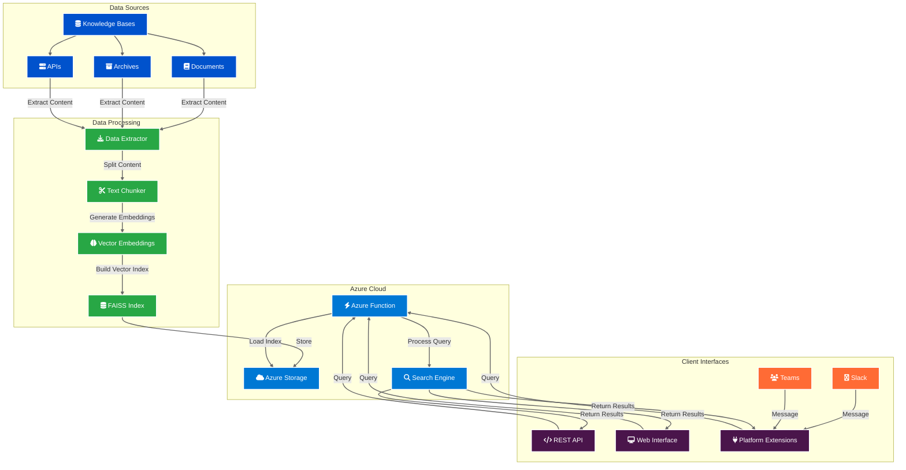

# Vector Knowledge Engine

An AI-powered vector search engine that provides semantic search capabilities across your organization's data sources. It leverages advanced AI techniques to understand natural language queries and retrieve relevant information from various knowledge repositories while maintaining source truth.

## AI Capabilities

This solution leverages AI in a focused way:
- **Semantic Search**: Uses AI-powered embeddings (Sentence Transformers) to understand the meaning behind queries, not just keywords
- **Neural Information Retrieval**: Employs FAISS (Facebook AI Similarity Search) for efficient vector similarity search
- **Natural Language Understanding**: Processes natural language queries to match them with relevant documentation
- **Non-Generative AI**: Unlike ChatGPT or other LLMs, this is a retrieval-focused system that finds and returns actual content rather than generating new content
- **Source-Truthful**: All responses are grounded in your organization's data sources, ensuring accuracy and reliability

## System Architecture



## 🔧 Quick Start

### Local Development
```bash
# Setup local environment
task setup:local

# Extract content from your data sources
task extract

# Build the vector index (improved version)
task build-index:improved

# Start the function locally
task func:start
```

### Azure Deployment
```bash
# Automated Azure setup
task setup:azure

# Upload your index
task azure:upload-index

# Deploy the function
task func:deploy
```

## 🔍 Search Quality Optimization

**Having trouble finding content you know exists?** The Vector Knowledge Engine includes several tools to improve search quality:

### Quick Diagnostic
```bash
# Analyze your data and search performance
task debug:search
```

### Improved Index Building
```bash
# Use enhanced chunking and Q&A optimized model
task build-index:improved

# Or try different models for better quality
task build-index:qa-model      # Optimized for Q&A
task build-index:large-model   # Higher quality, slower
```

### Configuration Tuning
- **Lower confidence threshold**: Change from 0.7 to 0.3 for better recall
- **Better embedding model**: Use `multi-qa-MiniLM-L6-cos-v1` for Q&A systems  
- **Improved chunking**: 400-character chunks with 100-character overlap
- **Query preprocessing**: Automatic abbreviation expansion and text normalization

📖 **Complete guide**: See [Search Quality Improvement Guide](docs/05-search-quality-guide.md)

## 🏗️ Architecture

## Documentation

- [Technical Overview](docs/01-technical-overview.md)
- [Local Setup](docs/02-local-setup.md)
- [Azure Setup (Manual)](docs/03-azure-setup.md)
- [Azure Automation](docs/04-azure-automation.md) ⭐ **Recommended**
- [System Architecture](docs/system-architecture.md)
- [Technical Implementation](docs/technical-implementation.md)

## Data Source Extensions

The system is designed to be extensible with various data sources:
- **Knowledge Bases**: Confluence, Notion, SharePoint
- **Communication**: Slack, Teams, Discord
- **Documentation**: Files, Wikis, Help Centers
- **Custom Sources**: API integrations, databases

## Prerequisites

- Python 3.12+
- [Task](https://taskfile.dev/#/installation)
- [Azure Functions Core Tools](https://learn.microsoft.com/en-us/azure/azure-functions/functions-run-local)
- Azure subscription

For detailed setup instructions and configuration options, please refer to the documentation guides.

## License

Internal use only. All rights reserved.
