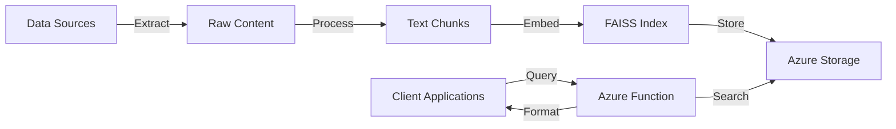

# Technical Overview

This document provides a comprehensive overview of the Vector Knowledge Engine system, its components, and technical implementation.

## System Overview

The Vector Knowledge Engine is a semantic search system that:
- Extracts knowledge from various data sources
- Uses AI to understand and answer questions
- Provides extensible interfaces for different platforms
- Runs serverlessly on Azure Functions with scalable architecture

## Architecture



## Core Components

### 1. Text Processing
- **Model**: `all-MiniLM-L6-v2` (Sentence Transformers)
- **Purpose**: Converts text into semantic vectors
- **Features**:
  - Semantic understanding
  - Language-agnostic
  - Optimized for similarity search

### 2. Search Engine
- **Technology**: FAISS (Facebook AI Similarity Search)
- **Index Type**: `IndexFlatL2`
- **Features**:
  - Fast vector similarity search
  - Exact L2 distance computation
  - Efficient for our scale

### 3. Azure Function App
- **Runtime**: Python 3.9+
- **Endpoints**:
  - `/api/search` - Direct search API
  - `/api/ask` - Platform-specific integration
  - `/api/health` - Health checks

### 4. Storage
- **Service**: Azure Blob Storage
- **Contents**:
  - FAISS index
  - Document chunks
  - Metadata

## Data Flow

### 1. Data Extraction
1. Raw data is stored in `data/raw` directory
2. Supports multiple data source types:

   **Confluence Integration**:
   ```
   CONFLUENCE_URL=your-confluence-url
   CONFLUENCE_USER=your-email
   CONFLUENCE_TOKEN=your-api-token
   CONFLUENCE_SPACE=your-space-key
   ```

   **Generic Data Sources** (via JSON format):
   ```json
   {
     "id": "unique-id",
     "title": "Document Title",
     "url": "source-url",
     "content": "document content",
     "last_modified": "ISO-8601 timestamp",
     "source_type": "confluence|sharepoint|notion|custom",
     "metadata": {
       "category": "documentation",
       "tags": ["api", "guide"]
     }
   }
   ```

### 2. Index Building
1. Raw content is processed from `data/raw`
2. Split into overlapping chunks (200 chars, 20 char overlap)
3. Generate embeddings using Sentence Transformers
4. Build FAISS index
5. Store in `data/index` directory:
   - `vector.index`: FAISS vector index
   - `chunks.json`: Document chunks with metadata

### 3. Index Storage Options
1. **Local Storage** (Default)
   - Index files remain in `data/index`
   - No additional configuration needed
   - Suitable for development and testing

2. **Azure Storage** (Production)
   - Upload index to Azure Blob Storage
   - Required environment variables:
     ```
     STORAGE_CONNECTION_STRING=your-azure-storage-connection
     STORAGE_CONTAINER_NAME=knowledge-base
     ```
   - Suitable for production deployment

### 4. Search Process
1. Receive query (via API or platform integration)
2. Load index from local storage or Azure (based on configuration)
3. Generate query embedding
4. Find similar chunks
5. Score and filter results
6. Format and return response (JSON, Slack, Teams, etc.)

## Platform Extensions

### Response Formats
- **JSON**: Standard API response format
- **Slack**: Block Kit formatted messages
- **Teams**: Adaptive Card format
- **Extensible**: Easy to add new platform formats

### Integration Options
- REST API for custom applications
- Webhook endpoints for chat platforms
- SDK support for direct integration

## Performance Characteristics

### Optimization Techniques
- Batch processing for large datasets
- Memory usage monitoring
- Garbage collection management
- Result caching where applicable

### Quality Control
- Confidence thresholds (0.5-0.7)
- Minimum chunk size requirements
- Context preservation through overlap

## Security

### Authentication
- Azure Function authentication
- Platform-specific signing secret verification
- Azure Storage access control

### Data Protection
- No sensitive data storage
- All communication over HTTPS
- Azure security best practices

## Monitoring

### Health Checks
- Endpoint availability
- Index accessibility
- Response times

### Metrics
- Query volume
- Response latency
- Storage usage
- Error rates

## Data Source Extensions

The system is designed to be easily extended with new data sources:

### Currently Supported
- **Confluence**: Pages and spaces
- **Generic JSON**: Custom data sources

### Planned Extensions
- **SharePoint**: Documents and sites
- **Notion**: Pages and databases
- **File Systems**: Documents and wikis
- **APIs**: Custom REST endpoints
- **Databases**: Structured data sources

## Next Steps

After understanding the technical implementation:
1. Follow [Local Development Setup](02-local-setup.md) for environment setup
2. See [Azure Setup](03-azure-setup.md) for cloud configuration
3. Check [System Architecture](system-architecture.md) for detailed architecture information
