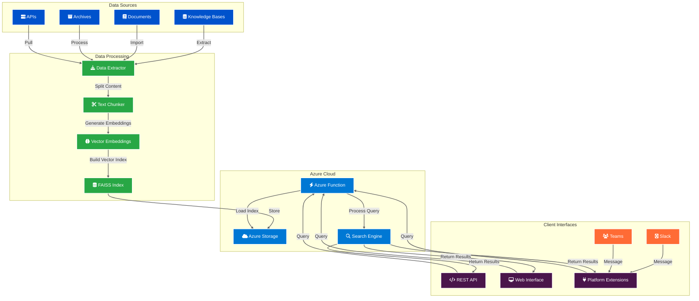

# Vector Knowledge Engine System Architecture

This diagram illustrates the architecture and data flow of our AI-powered vector search engine that processes multiple data sources and provides extensible client interfaces.

## System Architecture Diagram

## Key Components

1. **Data Sources** 📚
   - Knowledge Bases: Confluence, Notion, SharePoint
   - Documents: Files, PDFs, Web pages
   - Archives: Historical content, backups
   - APIs: Custom data sources, databases

2. **Data Processing Pipeline** ⚙️
   - Data Extractor: Pulls content from various sources
   - Text Chunker: Splits content into optimal chunks
   - Vector Embeddings: Converts text to semantic vectors
   - FAISS Index Builder: Creates searchable vector index

3. **Azure Cloud Infrastructure** ☁️
   - Blob Storage: Stores vector index and metadata
   - Function App: Serverless compute platform
   - Search Engine: Handles semantic queries and ranking

4. **Client Interfaces** 🔌
   - REST API: Standard JSON API for integrations
   - Web Interface: Direct web-based search
   - Platform Extensions: Chat platform integrations
     - Slack Bot: Interactive Slack interface
     - Teams Bot: Microsoft Teams integration

## Data Flow Process

### Ingestion Pipeline
1. **Data Extraction**: Content is pulled from various sources
2. **Text Processing**: Content is cleaned and chunked
3. **Vector Generation**: Text chunks are converted to embeddings
4. **Index Building**: FAISS index is created and stored
5. **Cloud Storage**: Index is uploaded to Azure Storage

### Query Pipeline
1. **Query Input**: User submits natural language query
2. **Vector Encoding**: Query is converted to embedding
3. **Similarity Search**: FAISS finds most similar content
4. **Result Ranking**: Results are scored and filtered
5. **Response Formatting**: Results are formatted for client type

## Extensibility Points

### New Data Sources
- Implement standardized extractor interface
- Support for custom metadata schemas
- Configurable content processing rules

### New Client Platforms
- Pluggable response formatters
- Platform-specific authentication
- Custom UI components

### Advanced Features
- Real-time index updates
- Multi-language support
- Custom embedding models
- Advanced filtering and search
