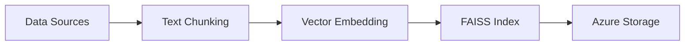

# Technical Implementation Details

This document outlines the core algorithms and technical implementation details of the Vector Knowledge Engine system.

## Core Technologies

### 1. Text Embedding Model
- **Model**: `all-MiniLM-L6-v2` (Sentence Transformers)
- **Purpose**: Converts text into dense vector representations
- **Characteristics**:
  - Lightweight yet powerful transformer architecture
  - Optimized for semantic similarity tasks
  - Captures contextual meaning beyond keyword matching
  - Produces fixed-size vector embeddings

### 2. Vector Search Engine (FAISS)
- **Implementation**: Facebook AI Similarity Search (FAISS)
- **Index Type**: `IndexFlatL2`
- **Features**:
  - Exact L2 (Euclidean) distance computation
  - Vector normalization for improved matching
  - Optimized for high-dimensional space search
  - Efficient nearest neighbor search capabilities

### 3. Text Processing Pipeline
- **Chunking Algorithm**:
  ```python
  CHUNK_SIZE = 200  # characters
  CHUNK_OVERLAP = 20  # characters
  MIN_CHUNK_SIZE = 50  # minimum viable chunk
  ```
- **Process**:
  1. Document splitting with sliding window
  2. Overlap handling for context preservation
  3. Size validation and filtering
  4. Metadata attachment to chunks

### 4. Scoring and Ranking System
- **Similarity Metric**: Cosine similarity
- **Score Normalization**: `normalized_score = (score + 1) / 2`
- **Quality Control**:
  - Confidence threshold: 0.5-0.7
  - Result ranking by similarity score
  - Configurable top-k results

## System Architecture

### Memory Management
1. **Batch Processing**
   - Configurable batch sizes for large datasets
   - Incremental index building
   - Garbage collection integration

2. **Storage Optimization**
   - Azure Blob Storage for persistence
   - Temporary file management
   - Memory usage monitoring via `psutil`

### API Implementation
1. **Request Handling**
   - Asynchronous API endpoints
   - JSON serialization/deserialization
   - Health monitoring system

2. **Integration Features**
   - Multiple response formats (JSON, Slack, Teams)
   - Multi-platform content synchronization
   - Azure Functions serverless architecture

## Workflow

### 1. Index Building


### 2. Search Process


## Data Source Extensibility

### 1. Extractor Interface
- **Standardized Input**: JSON format with required fields
- **Metadata Support**: Custom field handling
- **Content Processing**: Unified text cleaning pipeline

### 2. Supported Formats
- **Confluence**: Pages and spaces via REST API
- **Generic JSON**: Custom data source integration
- **File Systems**: Document and text file processing
- **APIs**: RESTful endpoint integration

## Response Format System

### 1. JSON Format (Default)
- Standard REST API response
- Structured result objects
- Metadata preservation

### 2. Platform-Specific Formats
- **Slack**: Block Kit formatting
- **Teams**: Adaptive Card format
- **Extensible**: Plugin architecture for new platforms

## Performance Characteristics

### Optimization Techniques
1. **Memory Efficiency**
   - Batch processing for large datasets
   - Garbage collection triggers
   - Memory monitoring and optimization

2. **Search Performance**
   - FAISS optimization for vector search
   - Asynchronous API handling
   - Result caching (where applicable)

3. **Quality Control**
   - Confidence score thresholds
   - Minimum chunk size requirements
   - Overlap for context preservation

## Technical Benefits

1. **Semantic Understanding**
   - Context-aware search beyond keywords
   - Natural language query support
   - Meaning-based matching

2. **Scalability**
   - Efficient vector search with FAISS
   - Memory-optimized processing
   - Cloud-native architecture

3. **Extensibility**
   - Modular data source integration
   - Platform-agnostic response formatting
   - Plugin architecture support

4. **Maintainability**
   - Modular component design
   - Clear separation of concerns
   - Comprehensive logging and monitoring

## Security Implementation

1. **Data Protection**
   - No persistent storage of sensitive data
   - HTTPS-only communication
   - Azure security best practices

2. **Authentication**
   - Platform-specific token validation
   - Azure Function App authentication
   - Role-based access control

3. **Privacy**
   - Configurable data retention
   - Anonymized logging
   - Audit trail capabilities

## Future Technical Considerations

1. **Potential Optimizations**
   - Index sharding for larger datasets
   - Query result caching
   - Dynamic confidence thresholds
   - Real-time index updates

2. **Scalability Improvements**
   - Distributed index support
   - Multi-region deployment
   - Auto-scaling optimization

3. **Feature Extensions**
   - Multi-language support
   - Query intent classification
   - Automated content summarization
   - Machine learning model fine-tuning

4. **Integration Enhancements**
   - SDK development for popular platforms
   - Webhook support for real-time updates
   - GraphQL API support
   - Enterprise SSO integration
